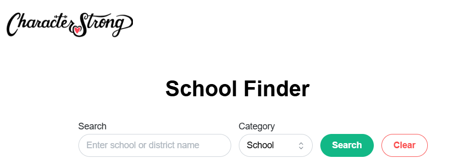

# 📚 CharacterStrong School Finder

A responsive React + TypeScript application that allows users to search for U.S. schools and school districts using NCES and ArcGIS APIs. Results are visualized on an interactive Google Map with detailed views for both schools and districts.



---

## 🚀 Features

- 🔍 Search for schools or districts by name or city  
- 🗂 Filter between "School" and "District" results  
- 🗺 View results on an interactive Google Map  
- 🧭 School details slide in via left-side drawer  
- 🏫 District results support school drill-down via right-side drawer  
- 📱 Fully responsive and mobile-friendly  
- 💅 Built with Mantine UI and Google Maps API  

---

## 🛠 Tech Stack

- [React](https://reactjs.org/) + [TypeScript](https://www.typescriptlang.org/)  
- [Mantine](https://mantine.dev/)  
- [Google Maps JavaScript API](https://developers.google.com/maps/documentation/javascript)  
- [NCES + ArcGIS APIs](https://data-nces.opendata.arcgis.com/)  
- [Vite](https://vitejs.dev/)  
- Deployed via [Vercel](https://character-strong-project.vercel.app/)

---

## 📦 Setup

### 1. Clone the repository

```bash
git clone https://github.com/matteofols/react-interview-exercise.git
cd "react-interview-exercise-main 3"

###  2. Install Dependencies

```bash
npm install

npm run dev

### The project should be running on localhost:3000
